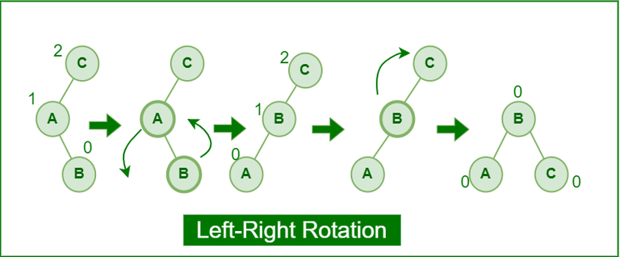
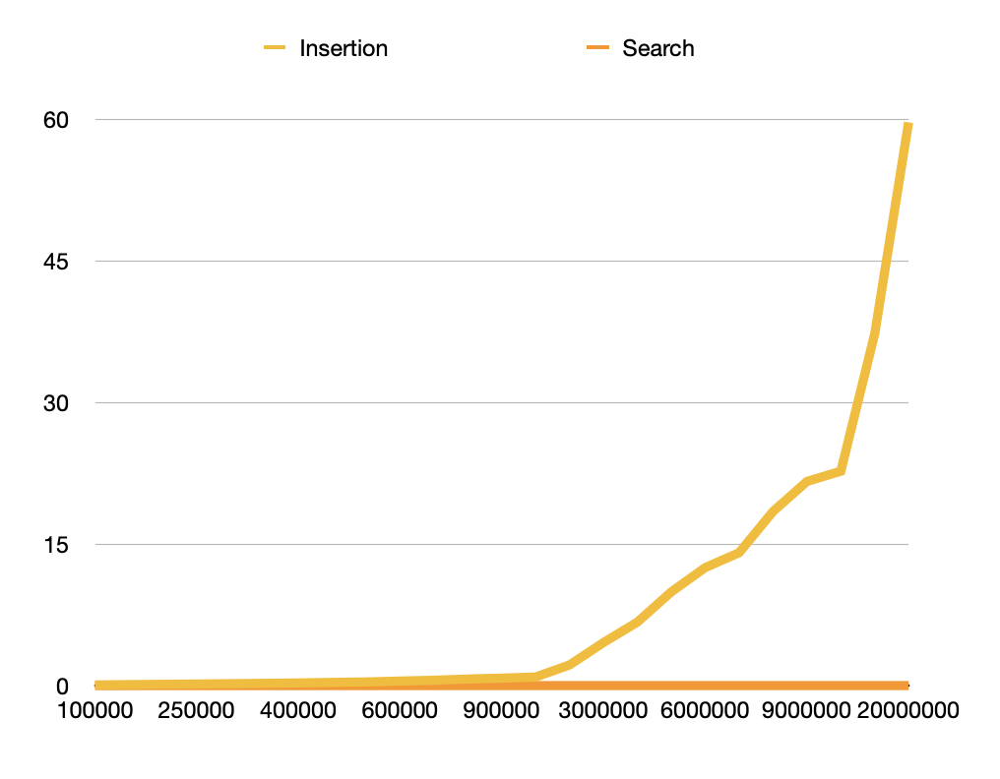

# Research Paper
* Name: Naomi Zhong
* Semester: Su2023
* Topic: AVL tree in c
* Link The Repository: https://github.com/Su23-CS5008-Online-Lionelle/finalresearchpaper-naomiizhong.git


Note the following is an example outline to help you. Please rework as you need. 

## Introduction

The data structure in question here is the AVL tree data structure. Named after the three inventors Adelson, Velski and Landis, an avl tree is a binay search tree that self balances so that the height difference of the left and the right sub-trees is no more than 1.

### A Quick Recap on Data Structure
In computer science, a data structure is a particular way to organize data with the purpose of efficient access to data. More precisely, a data structure is a collection of data values, the relationships among them, and the functions or operations that can be applied to these data. It is an algebraic structure about data.
Data structures are usually divided into two types: the linear and the non-linear. Linear data structure includes arrays, linked list, stacks and queue, while non-linear data structure includes binary trees, binary search trees, heaps and hash, madtrix and graphs, and so on. In general, non-linear data structure has a better search time. The time complexity for non-linear data structure usually remain the same with increase in size of the data. On the contrary, time complexity of linear data structure often increases with increase in size. Below is a graph of comparison between linear and non-linear data structures:


### the Birth of AVL Tree
The AVL tree falls under the latter, namely non-linear data structure.
Sometimes non-linear data structure, under its worst-case performance, can have a big O close to linear data structure. For example, it is observed that the binary search tree (BST) data structure, although usually having an average performance of $O(log n)$, can regress to $O(n)$ under its worst performance. In the worse-case scenario, the data stored in every node that is added to the BST is greater than the one that precedes it, or whenever every node added is less than the one that precedes it. Under this condition, the BST degenerates to a linked list, resulting in a big O similar to that of the linked list, namely $O(n)$. There is a need to avoid the worst case scenario, so that BST as a non-linear data structure can maintain its efficiency under all sorts of scenario.
This is where the AVL tree comes in. The AVL tree is an improved version of the BST tree where it checks the height of the left and the right sub-trees to makre sure that the height difference is no more than 1. This is what we call the Balance Factor.
How do we know if a tree is balanced or not? In other words, what is the definition of a balanced tree? In general, a balanced binary tree is one in which no leaf nodes are "too far" from the root. In most cases, "not too far" means that all leaf nodes have a depth that differ by at most 1, but the exact number can vary from application to application.
Under this common definiton, an AVL tree is basically a BST tree that is always balanced. Thus theoretically the big O for inserting data into an AVL tree, with any sort of data set, should stay $O(log n)$. Below is a summary of the time complexity for an AVL tree, in theory.


This report focuses on the analysis of the time complexity of an AVL tree. Does the data correspond with the theory? Does an AVL maintains its ideal big O even with tricky data set? These are the questions that we aim to answer in this report.

Below is an example of an AVL tree:


As you can see, the differences between the heights of left and right subtrees for every node are less than or equal to 1.


## Analysis of Algorithm/Datastructure
Make sure to include the following:
- Time Complexity
- Space Complexity
- General analysis of the algorithm/datastructure


### Mechanism: how does it work
Now let us go into depth about how an AVL tree works. How does an AVL tree stay balanced? By constantly checking its balance factor and rotating correspondingly. The core (the "soul") of an AVL tree is its ability to "rotate". An AVL tree may rotate in one of the following four ways to keep itself balanced.

#### 1. left rotate
When a node is added into the right subtree of the right subtree, we do a single left rotation if it's out of balance.


Here are the code in C for the left rotation:
```t_node* leftRotate(t_node* a) {
    t_node* b = a->right;
    t_node* c = b->left;

    // Perform rotation
    b->left = a;
    a->right = c;

    // Update heights
    a->height = max(getHeight(a->left), getHeight(a->right)) + 1;
    b->height = max(getHeight(b->left), getHeight(b->right)) + 1;

    return b;
}
```


#### 2. right rotate
When a node is added into the left subtree of the left subtree, we do a single right rotation if it's out of balance.


Here are the code in C for the right rotation:
```t_node* rightRotate(t_node* a) {
    t_node* b = a->left;
    t_node* c = b->right;

    // Perform rotation
    b->right = a;
    a->left = c;

    // Update heights
    a->height = max(getHeight(a->left), getHeight(a->right)) + 1;
    b->height = max(getHeight(b->left), getHeight(b->right)) + 1;

    return b;
}
```

#### 3. left-right rotate
This is a combination of a left rotation followed by a right rotation.



#### 4. right-left rotate
This is a combination of a right rotation followed by a left rotation.


### Time Complexity and Space Complexity
Theoretically the time and space complexity for an AVL tree is the same as these for a balanced BST.
Here are a chart representing the complexity for generic binary trees, binary search trees and balanced binary search trees.


We've briefly talked about the theoretical time complexity for an AVL tree. For the convinience of the discussion, I am going to use the same chart again:


As we can see, the big O for insert, delete and search in an AVL tree are all $O(log n)$. The space complexity for an AVL tree is $O(n)$. It is exactly the same as a balanced BST.
We are going to prove this point by using empirical data generated by a C script that calculates the time for insertion and search in an AVL tree with different size of data set.


## Empirical Analysis

### Methodology
The main tool for generating the empirical data is this test script we made to calculate time for search and insertion in an AVL tree. The script generates a random set of integers with a given data size, and insert those data as nodes into an AVL tree. By changing the data size, we collect the corresponding time spent for each and plot them into a graph. 
At the very beginning of the test script, we set up an integer variable as the size of the avl tree, as follows:
```int main() {
    t_node* root = NULL;
    int numNodes = 20000000;  // Adjust this value as needed
```
By changing the "int numNodes", the test script calculates the time spent for the program to create an AVL tree and inserting all the data (randomly generated by the rand()) into the AVL tree. At the same time, the test script also calculate the time spent to search all the data in the avl tree.
Each run the script returns two data point: time taken for the insertions and time taken for the searches, printed on the terminal. I took a screenshot of what it looks like: 


Then we collect the data and put them into an excel, then plot them into charts. The original data generated is also included in the project.

### Results

#### Challenges
Here is the chart plotted using all the data generated:


As we can see, the runtime for searches is constant, which accords to our theory. However, the runtime for insertion, much to our surprise, is nothing like $O(log n)$, but more of a $O(n^2)$. 

#### Hypothesis
Immediately we challenge the integrity of the data. Here are several hypotheses I came up with that explains the discrepancy between our data and the theory.
1. not enough data point. We have 47 data points. Although the data size ranges from 10 to 20000000, we simply do not have a large enough data set to leave room for one or two miscalculated data. In other words, if one or two data points are miscalculated, it will affect the result tremendously. 
2. not enough charts generated. Instead of generating one chart, we should try generating several charts using different sections of the data from our data set. If the charts generated are very different from each other, it will also prove our first point.
3. problematic local machine. There is also a possibility that the computer that we use to generate those data is glitchy, resulting in random data points.
4. There is also a possiblity that the AVL tree is bad at storing too large a data set, as we mentioned earlier that the search for avl tree is always fast whereas insertion gets drastically slower once the data set passes a certain size. 

#### An Attempt to Find the Cause
I decided to plotseveral more charts using different sections of the data. Here are five charts I generated:





 
 If we look at chart 2, before the data size hit 100000, the curve of the chart is close to $O(log n)$. Once it passes 100000, the insertion time becomes almost exponential. This observation might support our last hypothesis, which is that AVL tree only has an ideal big O if the data set is relatively small, around 100000.

#### Conclusion
For the analysis of the time complexity for a data structure, the data point should be no less than 100 to yield any meaningful results.
Our data point has correctly proved the search time but ambiguously reflected the time compleity of the insertion of an AVL tree. Furthermore, we observe that an AVL tree only has an ideal big O if the data set is relatively small, around 100000.


## Application
The avl tree is usually used for in-memory sorts of sets and dictionaries. It is also used in databases where applications in which insertions and deletions are fewer but there are frequent lookups for data. This is because the avl tree involves rotations and the balancing factor, which makes it a complicated data structure. If there are many insertions, it leads to a lot of rotations which can be avoided if using other data structures such as the Red-Black Tree.
At the core an AVL tree is a balanced BST whose main feature, as indicated in its name, is searching.
One application that involves a lot of searching is the auto-completion and spelling checking. AVL trees are used in applications that require fast auto-completion suggestions or spell checking. The balanced structure allows for quick prefix searches, making them suitable for these tasks. However, further research suggests that there are better algorithms for spell checkers, such as a prefix tree, or an approximate string matching algorithm such as Levenshtein distance.
Research suggests that one of the most common application for an AVL tree is database indexing. AVL trees are commonly used in database management systems to index data. They provide fast access to records, enabling efficient searching, insertion, and deletion of data in the database.
Another data structure for searching is the hash tables, compared to which our avl tree has several advantages over. The major disadvantage of the hash table is its static table size, which requires costly resizing if indexed set is highly dynamic. On the contrary, an AVL tree can offer self-contained and data-independent implementation. It also easily accommodates insertion and deletion. Its disadvantage, the design complication, can be justified by its relatively cheap cost for searching.
In the most general form, database applications have large sets of records that are frequently updated; searching is usually by one or a combination of several keys. To manage such databases, we can use an AVL to store primary and secondary key indices. A generaic BST can store duplicate key values, providing efficient insertion and deletion.


## Implementation
For this report we chose C as our implementation language.
In terms of the libraries used, they are stdio.h, stdlib.h and stdbool.h.
The challenges we faced in implementing is the multiple use of recursion. 
Recursion is used in most of the function implementation here, including search, insert, delete, in order traversal and free tree. 
Here are some examples of the recursions used in this implementation.
Insertion:
```
t_node* insert(t_node* root, int key) {
    
    // Perform standard BST insertion
    if (root == NULL) return createNode(key);

    if (key < root->key) root->left = insert(root->left, key);
    else if (key > root->key) root->right = insert(root->right, key);
    else return root; // Duplicate keys are not allowed
```

Deletion:
```
t_node* deleteNode(t_node* root, int key) {
    if (root == NULL) return root;

    // Perform standard BST delete
    if (key < root->key) root->left = deleteNode(root->left, key);
    else if (key > root->key) root->right = deleteNode(root->right, key);
```
Free Tree:
```
void freeTree(t_node* root) {
    if (root == NULL) return;
    freeTree(root->left);
    freeTree(root->right);
```
Search:
```
t_node* search(t_node* node, int key) {
    if (node == NULL || node->key == key) {
        return node;
    }

    if (node->key > key) {
        
        return search(node->left, key);;
    }
    else {
        return search(node->right, key);
    }
}  
```
In Order Travesal:
```
void inOrderTraversal(t_node* root) {
    if (root == NULL) return;
    inOrderTraversal(root->left);
    printf("%d ", root->key);
    inOrderTraversal(root->right);
}
```

Recursions make a function much more compact but at the same time is harder to write.

## Summary
- Provide a summary of your findings
- What did you learn?
Here is a set of detailed process for analyzing a data structure or an algorithm.
The analysis of a data structure or algorithm starts with the blueprint of the design of the data structure, usually in the form of natural language and Pseudo-codes. The blueprint is then implemented by a chosen language. After the data structure is implemented, we create a set of measurable schemes to generate relevant data. The actual generation of data is done by a script, usually in the same language as the one chosen for the implementation. The script takes in different input and generates output accordingly, the input point usually not less than 100. The data is then usually presented in the form of a chart or multiple charts for the sake of its clarity. The result will be compared to the theories and analyzed if discrepancy is detected.
We then come up with several hypotheses to explain this discrepancy, then generate more data to prove the hypothesis. This process shall be repeated if there exist several hypotheses.
Eventually a conclusion is reached.

We learnt from this analysis that the AVL tree data structure is always balanced and therefore great for any searching purpose, under the condition that deletion and insertion is less frequent and the whole data set is relatively small.


## Reference
https://www.geeksforgeeks.org/introduction-to-avl-tree/?ref=lbp
https://www.geeksforgeeks.org/difference-between-linear-and-non-linear-data-structures/
https://www.tutorialspoint.com/difference-between-linear-and-non-linear-data-structures#:~:text=In%20linear%20data%20structure%2C%20data,are%20present%20at%20various%20levels.&text=In%20linear%20data%20structure%2C%20all,present%20at%20a%20single%20level.
https://en.wikipedia.org/wiki/Data_structure
https://www.geeksforgeeks.org/introduction-to-avl-tree/
https://people.orie.cornell.edu/snp32/orie_6125/data-structures/binary-tree.html#:~:text=A%20balanced%20binary%20tree%20is,one%20that%20is%20not%20balanced.
https://github.com/enkidevs/curriculum/blob/master/comp-sci/data-structures-and-algorithms/binary-search-tree/balanced-vs-unbalanced-binary-trees.md
https://iq.opengenus.org/time-complexity-of-avl-tree/
https://www.softwaretestinghelp.com/avl-trees-and-heap-data-structure-in-cpp/#Applications_Of_AVL_Trees
https://www.interviewkickstart.com/learn/data-structures-and-algorithms-avl-trees
https://en.wikipedia.org/wiki/Spell_checker#:~:text=Spell%20checkers%20can%20use%20approximate,instead%20of%20correctly%2Dspelled%20words.
https://opendsa-server.cs.vt.edu/ODSA/Books/CS3/html/TreeIndexing.html#:~:text=One%20approach%20would%20be%20to,can%20perform%20efficient%20range%20queries.